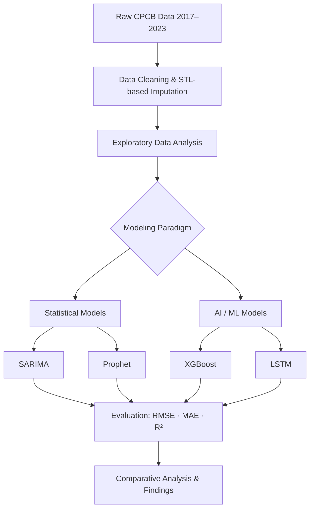

<div align="center">

# 🌫️ Forecasting Air Quality Index (AQI)
### A Comparative Study of Statistical, Machine Learning & Deep Learning Models

[](https://www.python.org/)
[](https://www.r-project.org/)
[](https://www.tensorflow.org/)
[](https://xgboost.readthedocs.io/)
[](https://facebook.github.io/prophet/)
[](LICENSE)

*A dissertation project comparing SARIMA, Prophet, XGBoost, and LSTM for forecasting PM2.5 / PM10 across four Delhi monitoring stations (2017–2023).*

[Overview](#-overview) • [Results](#-results) • [Methodology](#-methodology) • [Repository Structure](#-repository-structure) • [Setup](#-installation--usage) • [Findings](#-key-findings) • [Team](#-team--acknowledgements)

</div>

---

## 📌 Overview

Delhi consistently ranks among the most polluted cities in the world, and short-term forecasting of hazardous air quality events remains a major challenge for public health early-warning systems. This project benchmarks **four forecasting paradigms** — two classical statistical models and two AI/ML models — to determine which approach best predicts PM2.5 and PM10 concentrations using only historical pollutant data.

**Research question:** *Can modern machine learning and deep learning models meaningfully outperform classical statistical time-series methods in forecasting extreme, non-linear air pollution spikes?*

| | |
|---|---|
| 🎓 **Project type** | M.Sc. Statistics dissertation (Final Year, 2025–26) |
| 🏛️ **Institution** | Department of Statistics & Operations Research, Aligarh Muslim University |
| 📍 **Study area** | 4 CPCB monitoring stations across Delhi, NCR |
| 🗓️ **Data range** | 2017 – 2023 (hourly, aggregated to daily) |
| 🎯 **Target variables** | PM2.5 and PM10 (µg/m³) |

---

## 🔬 Methodology



**Pipeline highlights:**
- **Missing data** ranged from <3.5% (Okhla, Sonia Vihar) to over 40% (IGI Airport) — handled via **STL-decomposition-based imputation** to preserve seasonal structure rather than naive fill methods.
- **Stationarity** was confirmed via ADF/KPSS tests; SARIMA required first-order (d=1) and seasonal (D=1) differencing.
- Each station was modeled **independently** (location-specific modeling) rather than pooled, since Delhi's stations show high spatial heterogeneity (industrial vs. residential vs. transport-dominated zones).

---

## 🧠 Models Implemented

| Model | Type | What it captures | Key parameters used |
|---|---|---|---|
| **SARIMA** | Classical statistical | Linear trend + seasonality via autoregression | Orders auto-selected via `auto.arima()`, seasonal period *s* = 365 |
| **Prophet** | Classical statistical (additive) | Trend + yearly seasonality + holiday effects | 80/20 chronological train-test split |
| **XGBoost** | Machine learning (gradient-boosted trees) | Non-linear patterns from engineered lag features | 60-day lag window, 7-day rolling mean, cyclic day-of-year/week features, 500 trees, depth 6, learning rate 0.05 |
| **LSTM** | Deep learning (recurrent neural network) | Long-term temporal dependencies, learned directly from sequences | 14-day sequence window, 64 LSTM units, dropout 0.2, 120 epochs with early stopping |

---

## 📊 Results

**Comparative performance — RMSE & MAE for PM2.5 forecasts (test set)**

| Station | SARIMA (RMSE / MAE) | Prophet (RMSE / MAE) | XGBoost (RMSE / MAE) | LSTM (RMSE / MAE) |
|---|---|---|---|---|
| DL016 — IGI Airport | 50.38 / 29.44 | 50.26 / 37.41 | 21.67 / 14.09 | 19.76 / 13.85 |
| DL017 — Lodhi Road | 38.15 / 22.01 | 39.98 / 29.20 | **6.40 / 0.71** | 11.98 / 9.24 |
| DL019 — Okhla Phase-2 | 49.21 / 27.68 | 63.68 / 45.74 | **3.99 / 0.85** | 12.38 / 8.59 |
| DL023 — Sonia Vihar | 38.25 / 21.68 | 61.87 / 46.67 | **4.07 / 1.05** | 13.36 / 10.25 |

> At Lodhi Road, XGBoost also achieved a test **R² of 0.9919** for PM2.5, with train/test error remaining stable — indicating strong generalization without significant overfitting.

---

## 🔑 Key Findings

- **AI/ML models decisively outperformed statistical models** at every station — roughly a **5–6× reduction in RMSE** for XGBoost vs. SARIMA at Lodhi Road.
- **LSTM was the most consistent performer** across all four stations, regardless of whether the site was industrial or residential — showing strong generalization.
- **XGBoost achieved the lowest overall error** but dipped slightly at the airport station, likely due to more erratic, transient aviation-related emissions.
- **SARIMA and Prophet struggled with sudden spikes** (e.g., stubble-burning/winter smog events) since both are fundamentally linear/additive — Prophet in particular under-predicted extremes.
- **Location-specific modeling outperformed a pooled/panel approach**, confirming that Delhi's stations have distinct pollution "fingerprints" that a single model would average away.

---

## 📁 Repository Structure

```
AQI-Forecasting-Comparative-Study/
├── data/
│   ├── raw/                  # Original CPCB station data
│   └── processed/            # Cleaned & imputed datasets
├── notebooks/                # EDA and exploratory notebooks
├── src/
│   ├── preprocessing/
│   │   └── 01_eda_and_imputation.R   # Cleaning, EDA, month×hour imputation
│   ├── models/
│   │   ├── sarima_model.R            # SARIMA (auto.arima), stationarity tests
│   │   ├── prophet_model.R           # Prophet, train/test accuracy
│   │   ├── xgboost_train_eval.py     # XGBoost regression pipeline + metrics
│   │   ├── xgboost_forecast.py       # XGBoost 365-day iterative forecast
│   │   └── lstm_model.py             # LSTM sequence model + diagnostics
│   └── evaluation/           # RMSE, MAE, R² computation & comparison scripts
├── results/
│   ├── figures/               # Plots: actual vs predicted, residuals, seasonality
│   └── metrics/                # Saved metric tables (CSV)
├── report/
│   └── Dissertation_Group_A.pdf
├── requirements.txt
├── LICENSE
└── README.md
```

---

## ⚙️ Installation & Usage

```bash
# 1. Clone the repository
git clone https://github.com/hasiblayek/AQI-Forecasting-Comparative-Study.git
cd AQI-Forecasting-Comparative-Study

# 2. Set up a Python environment (for XGBoost / LSTM)
python -m venv venv
source venv/bin/activate        # On Windows: venv\Scripts\activate
pip install -r requirements.txt

# 3. Run preprocessing (R, requires `tidyverse`, `zoo`, `corrplot`)
Rscript src/preprocessing/01_eda_and_imputation.R

# 4. Run the statistical models (requires R with `forecast` and `prophet` packages)
Rscript src/models/sarima_model.R
Rscript src/models/prophet_model.R

# 5. Run the AI/ML models
python src/models/xgboost_train_eval.py   # train/test evaluation (Table 4.5 style metrics)
python src/models/xgboost_forecast.py     # 365-day forward forecast with lag features
python src/models/lstm_model.py           # LSTM sequence model + diagnostic plots
```

> 💡 Adjust file paths in each script's config section to point to your local `data/processed/` directory.

---

## 🛠️ Tech Stack

- **Languages:** Python, R
- **Statistical modeling:** `forecast` (auto.arima), `prophet`, `tseries`
- **Machine learning:** `xgboost`, `scikit-learn`
- **Deep learning:** `TensorFlow` / `Keras`
- **Data handling:** `pandas`, `numpy`
- **Visualization:** `matplotlib`

---

## 🚀 Future Work

- [ ] **Hybrid ARIMA–LSTM model** combining linear structure with non-linear learning
- [ ] **Exogenous data integration** — satellite Aerosol Optical Depth (AOD) from MODIS/Sentinel-5P to capture cross-border stubble-burning effects
- [ ] **Explainable AI (SHAP)** to interpret XGBoost/LSTM "black-box" predictions for policymakers
- [ ] **Spatio-Temporal Graph Neural Networks (GNNs)** to model pollution flow *between* stations rather than in isolation

---

## 👥 Team & Acknowledgements

This project was completed as a group dissertation for the M.Sc. Statistics program (Course: STM3072 – Project), under the Department of Statistics & Operations Research, Aligarh Muslim University.

**Group members:**
Mohd Farhan Khan · **Abdul Hasib** · Mohd Arhab Ahmad · Mohammad Zaid · MD Aabish Rahman

**Supervised by:** Prof. Aquil Ahmed & Dr. Aijaz Ahmad Dar

---

## 📄 Citation

If you reference this work, please cite it as:

```
Khan, M.F., Hasib, A., Ahmad, M.A., Zaid, M., & Rahman, M.A. (2026).
Forecasting the Air Quality Index using Statistical, Machine Learning and
Deep Learning Models: A Comparative Study. M.Sc. Dissertation,
Department of Statistics & Operations Research, Aligarh Muslim University.
```

---

## 📬 Contact

**Abdul Hasib**
📧 hasib.stats@gmail.com
🔗 [github.com/hasiblayek](https://github.com/hasiblayek)

---

## 📜 License

This project is licensed under the [MIT License](LICENSE) — feel free to use the methodology and code with attribution.

<div align="center">

⭐ *If you find this project useful, consider giving it a star!*

</div>
